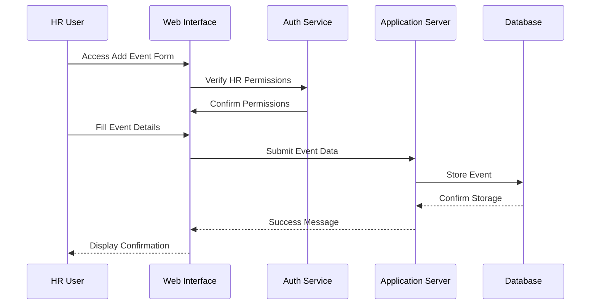

```mermaid
sequenceDiagram
    participant HR as HR User
    participant UI as Web Interface
    participant Auth as Auth Service
    participant App as Application Server
    participant DB as Database

    HR->>UI: Access Add Event Form
    UI->>Auth: Verify HR Permissions
    Auth->>UI: Confirm Permissions
    HR->>UI: Fill Event Details
    UI->>App: Submit Event Data
    App->>DB: Store Event
    DB-->>App: Confirm Storage
    App-->>UI: Success Message
    UI-->>HR: Display Confirmation
```