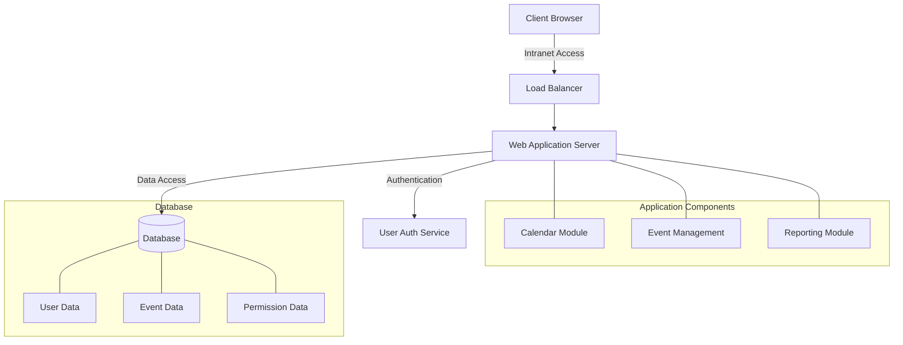

```mermaid
flowchart TD
    A[Client Browser] -->|Intranet Access| B[Load Balancer]
    B --> C[Web Application Server]
    C -->|Authentication| D[User Auth Service]
    C -->|Data Access| E[(Database)]
    
    subgraph AppComponents[Application Components]
        F[Calendar Module]
        G[Event Management]
        H[Reporting Module]
    end
    
    C --- F
    C --- G
    C --- H
    
    subgraph DB[Database]
        I[User Data]
        E --- I
        J[Event Data]
        E --- J
        K[Permission Data]
        E --- K
    end
```
