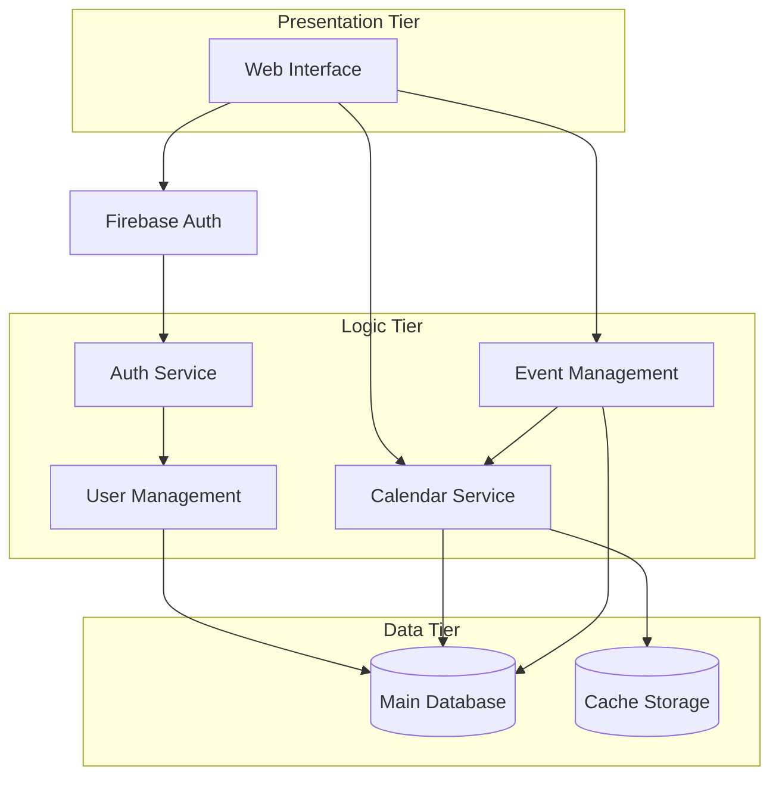

```mermaid
flowchart TB

    %% External Service
    Firebase[Firebase Auth]:::external
    
    %% Presentation Tier
    subgraph PT[Presentation Tier]
        direction TB
        UI[Web Interface]
    end
    
    %% Application/Logic Tier
    subgraph LT[Logic Tier]
        direction TB
        AuthService[Auth Service]
        EventLogic[Event Management]
        Calendar[Calendar Service]
        UserMgmt[User Management]
    end
    
    %% Data Tier
    subgraph DT[Data Tier]
        direction TB
        DB[(Main Database)]
        Cache[(Cache Storage)]
    end
    
    %% Connect the tiers with data flow
    UI --> Firebase
    Firebase --> AuthService
    UI --> EventLogic
    UI --> Calendar
    
    AuthService --> UserMgmt
    EventLogic --> Calendar
    
    UserMgmt --> DB
    Calendar --> DB
    EventLogic --> DB
    Calendar --> Cache
```