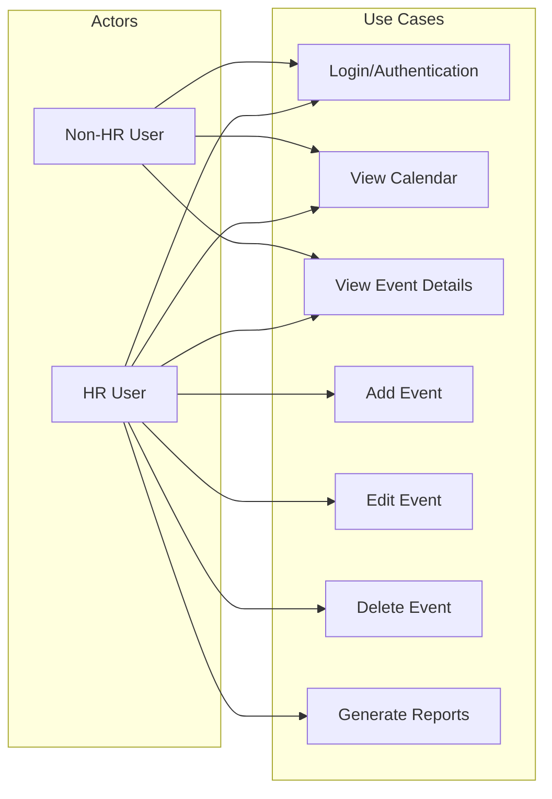

```mermaid
graph LR
    subgraph Actors
        HR[HR User]
        NonHR[Non-HR User]
    end

    subgraph Use Cases
        A[Login/Authentication]
        B[View Calendar]
        C[View Event Details]
        D[Add Event]
        E[Edit Event]
        F[Delete Event]
        G[Generate Reports]
    end

    HR --> A
    HR --> B
    HR --> C
    HR --> D
    HR --> E
    HR --> F
    HR --> G
    
    NonHR --> A
    NonHR --> B
    NonHR --> C
```